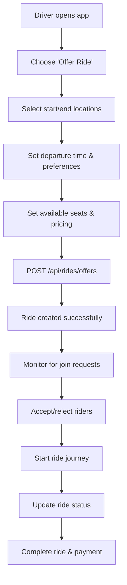

# 🚗 CoRide Morocco Backend - Ride Management API Documentation

## 📋 Overview
Complete API documentation for the Ride Management System in CoRide Morocco Backend. This system handles ride creation, searching, joining, and lifecycle management.

## 🎯 User Flow for Frontend Developers

### 📱 **Complete Ride Flow (Frontend Implementation Guide)**

#### **1. Driver Flow: Creating and Managing Ride Offers**


#### **2. Rider Flow: Finding and Joining Rides**
```mermaid
graph TD
    A[Rider opens app] --> B[Choose 'Find Ride']
    B --> C[Enter start/end locations]
    C --> D[Set date/time preferences]
    D --> E[POST /api/rides/search]
    E --> F[Browse available rides]
    F --> G[Select preferred ride]
    G --> H[POST /api/rides/{id}/join]
    H --> I[Wait for driver acceptance]
    I --> J[Receive confirmation]
    J --> K[Track ride status]
    K --> L[Complete ride & payment]
```

#### **3. Real-time Status Updates**
```javascript
// Frontend implementation for status tracking
const trackRideStatus = async (rideId) => {
  const interval = setInterval(async () => {
    try {
      const response = await fetch(`/api/rides/${rideId}`, {
        headers: { 'Authorization': `Bearer ${token}` }
      });
      const ride = await response.json();
      
      // Update UI based on status
      switch(ride.status) {
        case 'offered':
          showStatus('Waiting for riders');
          break;
        case 'matched':
          showStatus('Ride matched! Contact driver');
          break;
        case 'in_progress':
          showStatus('Ride in progress');
          break;
        case 'completed':
          showStatus('Ride completed');
          clearInterval(interval);
          break;
      }
    } catch (error) {
      console.error('Error tracking ride:', error);
    }
  }, 10000); // Check every 10 seconds
};
```

---

## 🛣️ **API Endpoints**

### **1. Create Ride Offer**
**Endpoint**: `POST /api/rides/offers`

**Description**: Create a new ride offer as a driver

**Authentication**: Required (Bearer Token)

**Headers**:
```
Content-Type: application/json
Authorization: Bearer YOUR_JWT_TOKEN
```

**Request Body**:
```json
{
  "start_address": "Casablanca, Mohammed V Airport",
  "end_address": "Rabat, Agdal District", 
  "start_latitude": 33.3675,
  "start_longitude": -7.5896,
  "end_latitude": 34.0142,
  "end_longitude": -6.8363,
  "departure_time": "2025-10-07T08:00:00Z",
  "available_seats": 3,
  "estimated_cost": 150.00,
  "cost_per_person": 50.00,
  "is_recurring": false,
  "smoking_allowed": false,
  "pets_allowed": true,
  "music_preferences": "any",
  "notes": "Pick up from Terminal 1, comfortable car with AC",
  "vehicle_info": "Toyota Corolla 2020 - White"
}
```

**Success Response (200 OK)**:
```json
{
  "id": 123,
  "driver_id": 7,
  "rider_id": null,
  "start_address": "Casablanca, Mohammed V Airport",
  "end_address": "Rabat, Agdal District",
  "start_latitude": 33.3675,
  "start_longitude": -7.5896,
  "end_latitude": 34.0142,
  "end_longitude": -6.8363,
  "departure_time": "2025-10-07T08:00:00Z",
  "arrival_time_estimated": "2025-10-07T09:30:00Z",
  "available_seats": 3,
  "occupied_seats": 0,
  "estimated_cost": 150.00,
  "cost_per_person": 50.00,
  "status": "offered",
  "is_recurring": false,
  "smoking_allowed": false,
  "pets_allowed": true,
  "music_preferences": "any",
  "notes": "Pick up from Terminal 1, comfortable car with AC",
  "vehicle_info": "Toyota Corolla 2020 - White",
  "created_at": "2025-10-06T14:30:00Z",
  "distance_km": 87.5,
  "driver": {
    "id": 7,
    "first_name": "Ahmed",
    "last_name": "Benali",
    "rating_average": 4.8,
    "rating_count": 25,
    "profile_photo_url": "https://res.cloudinary.com/coride/image/upload/v1234/profile_photos/user_7/photo.jpg"
  }
}
```

**Error Responses**:
- **400 Bad Request**: Invalid coordinates or data
- **401 Unauthorized**: Invalid or missing authentication token
- **422 Validation Error**: Invalid input data

---

### **2. Create Ride Request**
**Endpoint**: `POST /api/rides/requests`

**Description**: Create a new ride request as a rider

**Authentication**: Required (Bearer Token)

**Request Body**:
```json
{
  "start_address": "Rabat, Train Station",
  "end_address": "Casablanca, City Center",
  "start_latitude": 34.0142,
  "start_longitude": -6.8363,
  "end_latitude": 33.5731,
  "end_longitude": -7.5898,
  "departure_time": "2025-10-07T18:00:00Z",
  "flexible_time_minutes": 30,
  "max_cost_per_person": 60.00,
  "notes": "Need to be in Casablanca by 7 PM for business meeting"
}
```

**Success Response (200 OK)**:
```json
{
  "id": 124,
  "driver_id": null,
  "rider_id": 15,
  "start_address": "Rabat, Train Station",
  "end_address": "Casablanca, City Center",
  "start_latitude": 34.0142,
  "start_longitude": -6.8363,
  "end_latitude": 33.5731,
  "end_longitude": -7.5898,
  "departure_time": "2025-10-07T18:00:00Z",
  "arrival_time_estimated": null,
  "available_seats": 1,
  "occupied_seats": 0,
  "estimated_cost": 60.00,
  "cost_per_person": 60.00,
  "status": "requested",
  "is_recurring": false,
  "smoking_allowed": false,
  "pets_allowed": false,
  "music_preferences": null,
  "notes": "Need to be in Casablanca by 7 PM for business meeting",
  "vehicle_info": null,
  "created_at": "2025-10-06T15:00:00Z",
  "rider": {
    "id": 15,
    "first_name": "Fatima",
    "last_name": "Alami",
    "rating_average": 4.9,
    "rating_count": 18,
    "profile_photo_url": "https://res.cloudinary.com/coride/image/upload/v1234/profile_photos/user_15/photo.jpg"
  }
}
```

---

### **3. Search Available Rides**
**Endpoint**: `POST /api/rides/search`

**Description**: Search for available ride offers matching criteria

**Authentication**: Required (Bearer Token)

**Request Body**:
```json
{
  "start_latitude": 33.5731,
  "start_longitude": -7.5898,
  "end_latitude": 34.0142,
  "end_longitude": -6.8363,
  "departure_date": "2025-10-07",
  "departure_time_from": "07:00",
  "departure_time_to": "10:00",
  "max_distance_km": 15.0,
  "max_cost_per_person": 70.00,
  "available_seats_min": 1,
  "smoking_allowed": false,
  "pets_allowed": null,
  "sort_by": "departure_time",
  "limit": 10
}
```

**Success Response (200 OK)**:
```json
[
  {
    "id": 123,
    "driver_id": 7,
    "start_address": "Casablanca, Mohammed V Airport",
    "end_address": "Rabat, Agdal District",
    "start_latitude": 33.3675,
    "start_longitude": -7.5896,
    "end_latitude": 34.0142,
    "end_longitude": -6.8363,
    "departure_time": "2025-10-07T08:00:00Z",
    "arrival_time_estimated": "2025-10-07T09:30:00Z",
    "available_seats": 3,
    "occupied_seats": 0,
    "estimated_cost": 150.00,
    "cost_per_person": 50.00,
    "status": "offered",
    "smoking_allowed": false,
    "pets_allowed": true,
    "music_preferences": "any",
    "notes": "Pick up from Terminal 1, comfortable car with AC",
    "vehicle_info": "Toyota Corolla 2020 - White",
    "created_at": "2025-10-06T14:30:00Z",
    "distance_km": 5.2,
    "driver": {
      "id": 7,
      "first_name": "Ahmed",
      "last_name": "Benali",
      "rating_average": 4.8,
      "rating_count": 25,
      "profile_photo_url": "https://res.cloudinary.com/coride/image/upload/v1234/profile_photos/user_7/photo.jpg"
    }
  }
]
```

**Query Parameters**:
| Parameter | Type | Description |
|-----------|------|-------------|
| `sort_by` | string | Sort by: `departure_time`, `distance`, `price`, `created_at` |
| `limit` | integer | Maximum number of results (1-100) |

---

### **4. Join a Ride**
**Endpoint**: `POST /api/rides/{ride_id}/join`

**Description**: Request to join an available ride

**Authentication**: Required (Bearer Token)

**Path Parameters**:
| Parameter | Type | Required | Description |
|-----------|------|----------|-------------|
| `ride_id` | integer | ✅ | ID of the ride to join |

**Request Body**:
```json
{
  "message": "Hi! I'd like to join your ride. I'm a quiet passenger and always on time.",
  "pickup_address": "Casablanca Airport Terminal 2",
  "pickup_latitude": 33.3680,
  "pickup_longitude": -7.5900,
  "dropoff_address": "Rabat Train Station",
  "dropoff_latitude": 34.0140,
  "dropoff_longitude": -6.8365
}
```

**Success Response (200 OK)**:
```json
{
  "message": "Successfully joined the ride",
  "ride_id": 123,
  "status": "matched",
  "driver_contact": {
    "name": "Ahmed Benali",
    "rating": 4.8
  }
}
```

**Error Responses**:
- **404 Not Found**: Ride not found
- **400 Bad Request**: Ride not available, no seats, or cannot join own ride
- **403 Forbidden**: Not authorized

---

### **5. Get My Ride Offers**
**Endpoint**: `GET /api/rides/my-offers`

**Description**: Get current user's ride offers

**Authentication**: Required (Bearer Token)

**Query Parameters**:
| Parameter | Type | Description |
|-----------|------|-------------|
| `status_filter` | string | Filter by status: `offered`, `matched`, `in_progress`, `completed`, `cancelled` |
| `limit` | integer | Maximum results (default: 20) |
| `offset` | integer | Pagination offset (default: 0) |

**Success Response (200 OK)**:
```json
[
  {
    "id": 123,
    "driver_id": 7,
    "rider_id": 15,
    "start_address": "Casablanca, Mohammed V Airport",
    "end_address": "Rabat, Agdal District",
    "departure_time": "2025-10-07T08:00:00Z",
    "status": "matched",
    "available_seats": 3,
    "occupied_seats": 1,
    "cost_per_person": 50.00,
    "created_at": "2025-10-06T14:30:00Z",
    "rider": {
      "id": 15,
      "first_name": "Fatima",
      "last_name": "Alami",
      "rating_average": 4.9,
      "rating_count": 18,
      "profile_photo_url": "https://res.cloudinary.com/coride/image/upload/v1234/profile_photos/user_15/photo.jpg"
    }
  }
]
```

---

### **6. Get My Ride Requests**
**Endpoint**: `GET /api/rides/my-requests`

**Description**: Get current user's ride requests and joined rides

**Authentication**: Required (Bearer Token)

**Query Parameters**: Same as `/my-offers`

**Success Response (200 OK)**:
```json
[
  {
    "id": 125,
    "driver_id": 22,
    "rider_id": 7,
    "start_address": "Rabat, Agdal",
    "end_address": "Casablanca, Maarif",
    "departure_time": "2025-10-07T16:00:00Z",
    "status": "matched",
    "cost_per_person": 45.00,
    "created_at": "2025-10-06T13:15:00Z",
    "driver": {
      "id": 22,
      "first_name": "Youssef",
      "last_name": "Tazi",
      "rating_average": 4.7,
      "rating_count": 32,
      "profile_photo_url": "https://res.cloudinary.com/coride/image/upload/v1234/profile_photos/user_22/photo.jpg"
    }
  }
]
```

---

### **7. Get Ride Details**
**Endpoint**: `GET /api/rides/{ride_id}`

**Description**: Get detailed information about a specific ride

**Authentication**: Required (Bearer Token)

**Path Parameters**:
| Parameter | Type | Required | Description |
|-----------|------|----------|-------------|
| `ride_id` | integer | ✅ | ID of the ride |

**Success Response (200 OK)**:
```json
{
  "id": 123,
  "driver_id": 7,
  "rider_id": 15,
  "start_address": "Casablanca, Mohammed V Airport",
  "end_address": "Rabat, Agdal District",
  "start_latitude": 33.3675,
  "start_longitude": -7.5896,
  "end_latitude": 34.0142,
  "end_longitude": -6.8363,
  "departure_time": "2025-10-07T08:00:00Z",
  "arrival_time_estimated": "2025-10-07T09:30:00Z",
  "available_seats": 3,
  "occupied_seats": 1,
  "estimated_cost": 150.00,
  "cost_per_person": 50.00,
  "status": "matched",
  "is_recurring": false,
  "smoking_allowed": false,
  "pets_allowed": true,
  "music_preferences": "any",
  "notes": "Pick up from Terminal 1, comfortable car with AC",
  "vehicle_info": "Toyota Corolla 2020 - White",
  "created_at": "2025-10-06T14:30:00Z",
  "driver": {
    "id": 7,
    "first_name": "Ahmed",
    "last_name": "Benali",
    "rating_average": 4.8,
    "rating_count": 25,
    "profile_photo_url": "https://res.cloudinary.com/coride/image/upload/v1234/profile_photos/user_7/photo.jpg"
  },
  "rider": {
    "id": 15,
    "first_name": "Fatima",
    "last_name": "Alami",
    "rating_average": 4.9,
    "rating_count": 18,
    "profile_photo_url": "https://res.cloudinary.com/coride/image/upload/v1234/profile_photos/user_15/photo.jpg"
  }
}
```

---

### **8. Update Ride Status**
**Endpoint**: `PUT /api/rides/{ride_id}/status`

**Description**: Update ride status (driver or rider only)

**Authentication**: Required (Bearer Token)

**Path Parameters**:
| Parameter | Type | Required | Description |
|-----------|------|----------|-------------|
| `ride_id` | integer | ✅ | ID of the ride |

**Request Body**:
```json
{
  "new_status": "in_progress"
}
```

**Available Statuses**:
- `offered` - Ride is available for joining
- `requested` - Ride request is pending
- `matched` - Rider and driver are matched
- `in_progress` - Ride is currently happening
- `completed` - Ride finished successfully
- `cancelled` - Ride was cancelled

**Success Response (200 OK)**:
```json
{
  "message": "Ride status updated to in_progress",
  "ride_id": 123,
  "new_status": "in_progress"
}
```

---

### **9. Cancel Ride**
**Endpoint**: `DELETE /api/rides/{ride_id}`

**Description**: Cancel a ride (driver only)

**Authentication**: Required (Bearer Token)

**Path Parameters**:
| Parameter | Type | Required | Description |
|-----------|------|----------|-------------|
| `ride_id` | integer | ✅ | ID of the ride to cancel |

**Success Response (200 OK)**:
```json
{
  "message": "Ride cancelled successfully",
  "ride_id": 123,
  "status": "cancelled"
}
```

**Error Responses**:
- **404 Not Found**: Ride not found
- **403 Forbidden**: Only the driver can cancel a ride

---

### **10. Health Check**
**Endpoint**: `GET /api/rides/health`

**Description**: Health check for ride management service

**Authentication**: Not required

**Success Response (200 OK)**:
```json
{
  "status": "healthy",
  "service": "ride_management",
  "endpoints": [
    "ride_offers",
    "ride_requests",
    "ride_search",
    "ride_lifecycle",
    "ride_matching"
  ],
  "features": [
    "create_offers",
    "create_requests",
    "search_rides",
    "join_rides",
    "manage_lifecycle",
    "status_tracking"
  ],
  "timestamp": "2025-10-06T16:30:00Z"
}
```

---

## 📱 **Frontend Integration Examples**

### **JavaScript/React**
```javascript
// Ride Management Service
class RideService {
  constructor(baseURL, token) {
    this.baseURL = baseURL;
    this.token = token;
  }
  
  // Create ride offer
  async createRideOffer(rideData) {
    const response = await fetch(`${this.baseURL}/api/rides/offers`, {
      method: 'POST',
      headers: {
        'Content-Type': 'application/json',
        'Authorization': `Bearer ${this.token}`
      },
      body: JSON.stringify(rideData)
    });
    return response.json();
  }
  
  // Search rides
  async searchRides(searchParams) {
    const response = await fetch(`${this.baseURL}/api/rides/search`, {
      method: 'POST',
      headers: {
        'Content-Type': 'application/json',
        'Authorization': `Bearer ${this.token}`
      },
      body: JSON.stringify(searchParams)
    });
    return response.json();
  }
  
  // Join ride
  async joinRide(rideId, joinData) {
    const response = await fetch(`${this.baseURL}/api/rides/${rideId}/join`, {
      method: 'POST',
      headers: {
        'Content-Type': 'application/json',
        'Authorization': `Bearer ${this.token}`
      },
      body: JSON.stringify(joinData)
    });
    return response.json();
  }
  
  // Get my rides
  async getMyRides(type = 'offers', status = null) {
    const endpoint = type === 'offers' ? 'my-offers' : 'my-requests';
    const params = status ? `?status_filter=${status}` : '';
    
    const response = await fetch(`${this.baseURL}/api/rides/${endpoint}${params}`, {
      headers: {
        'Authorization': `Bearer ${this.token}`
      }
    });
    return response.json();
  }
  
  // Update ride status
  async updateRideStatus(rideId, newStatus) {
    const response = await fetch(`${this.baseURL}/api/rides/${rideId}/status`, {
      method: 'PUT',
      headers: {
        'Content-Type': 'application/json',
        'Authorization': `Bearer ${this.token}`
      },
      body: JSON.stringify({ new_status: newStatus })
    });
    return response.json();
  }
}
```

### **React Native/Expo**
```javascript
import AsyncStorage from '@react-native-async-storage/async-storage';

const RideService = {
  async createRideOffer(rideData) {
    try {
      const token = await AsyncStorage.getItem('access_token');
      const response = await fetch('http://192.168.1.2:8000/api/rides/offers', {
        method: 'POST',
        headers: {
          'Content-Type': 'application/json',
          'Authorization': `Bearer ${token}`
        },
        body: JSON.stringify(rideData)
      });
      
      if (!response.ok) {
        throw new Error('Failed to create ride offer');
      }
      
      return await response.json();
    } catch (error) {
      console.error('Error creating ride offer:', error);
      throw error;
    }
  },
  
  async searchRides(searchParams) {
    try {
      const token = await AsyncStorage.getItem('access_token');
      const response = await fetch('http://192.168.1.2:8000/api/rides/search', {
        method: 'POST',
        headers: {
          'Content-Type': 'application/json',
          'Authorization': `Bearer ${token}`
        },
        body: JSON.stringify(searchParams)
      });
      
      if (!response.ok) {
        throw new Error('Failed to search rides');
      }
      
      return await response.json();
    } catch (error) {
      console.error('Error searching rides:', error);
      throw error;
    }
  }
};
```

---

## 🔧 **Error Handling**

### **Common Error Responses**
```json
{
  "message": "Validation failed",
  "error_code": "VALIDATION_ERROR",
  "details": {
    "field_errors": {
      "start_latitude": ["Latitude must be between -90 and 90"],
      "available_seats": ["Available seats must be between 1 and 8"]
    },
    "total_errors": 2
  },
  "type": "validation_error"
}
```

### **Status Codes**
- **200 OK**: Success
- **400 Bad Request**: Invalid request data
- **401 Unauthorized**: Authentication required
- **403 Forbidden**: Access denied
- **404 Not Found**: Ride not found
- **422 Validation Error**: Input validation failed
- **500 Internal Error**: Server error

---

## 🧪 **Testing with cURL**

### **Create Ride Offer**
```bash
curl -X POST http://localhost:8000/api/rides/offers \
  -H "Authorization: Bearer YOUR_JWT_TOKEN" \
  -H "Content-Type: application/json" \
  -d '{
    "start_address": "Casablanca Airport",
    "end_address": "Rabat Center",
    "start_latitude": 33.3675,
    "start_longitude": -7.5896,
    "end_latitude": 34.0142,
    "end_longitude": -6.8363,
    "departure_time": "2025-10-07T08:00:00Z",
    "available_seats": 3,
    "estimated_cost": 120.00,
    "cost_per_person": 40.00,
    "vehicle_info": "Toyota Corolla - Clean & Comfortable"
  }'
```

### **Search Rides**
```bash
curl -X POST http://localhost:8000/api/rides/search \
  -H "Authorization: Bearer YOUR_JWT_TOKEN" \
  -H "Content-Type: application/json" \
  -d '{
    "start_latitude": 33.5731,
    "start_longitude": -7.5898,
    "end_latitude": 34.0142,
    "end_longitude": -6.8363,
    "departure_date": "2025-10-07",
    "max_distance_km": 10.0,
    "sort_by": "departure_time",
    "limit": 5
  }'
```

### **Join Ride**
```bash
curl -X POST http://localhost:8000/api/rides/123/join \
  -H "Authorization: Bearer YOUR_JWT_TOKEN" \
  -H "Content-Type: application/json" \
  -d '{
    "message": "Hi! I would like to join your ride.",
    "pickup_address": "Casablanca Train Station"
  }'
```

---

## 🎯 **Implementation Status**

### ✅ **Completed Features**
- ✅ **Ride Offer Creation** - Drivers can create ride offers
- ✅ **Ride Request Creation** - Riders can create ride requests
- ✅ **Ride Search** - Advanced search with filters and sorting
- ✅ **Ride Joining** - Riders can join available rides
- ✅ **Ride Management** - View, update, and manage rides
- ✅ **Status Tracking** - Complete ride status lifecycle
- ✅ **User Integration** - Driver/rider profile information
- ✅ **Geographic Validation** - Morocco-specific coordinate validation
- ✅ **Cost Management** - Pricing and cost calculation

### 🔄 **Upcoming Features**
- 📱 **Real-time Notifications** - Push notifications for ride updates
- 💬 **In-ride Communication** - Chat between driver and riders
- 📍 **Live Location Sharing** - Real-time GPS tracking
- ⭐ **Rating System** - Post-ride rating and reviews
- 🔄 **Recurring Rides** - Schedule regular commute rides
- 🚨 **Safety Features** - Emergency contacts and panic button

---

## 📞 **Support & Resources**

**Developer**: ZOUHAIRFGRA  
**Email**: zouhairfgra@gmail.com  
**Repository**: coride-morocco-backend  

**API Health Check**: `GET /api/rides/health`  
**Complete Documentation**: This document + Swagger UI at `/docs`

---

**Last Updated**: October 6, 2025  
**API Version**: 1.0.0  
**Status**: ✅ **Production Ready**